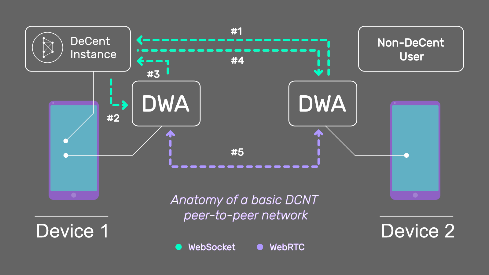

# Welcome, Good people!

<table>
  <tr>
    <td></td>
    <td></td>
  </tr>
</table>

## Introduction

<blockquote>Fuck the Babylon, who's trying to see what I'm on</blockquote>

This repository serves as a portal to the One True Interwebz, Web420.

Web420 combines the spirit of Yinterwebz of old with modern tech to bless the Good people with the modern webs they deserve.

DeCent is a collection of protocols and tools that, when forces combine, hold the power to flip traditional usage of the Internet on its head, putting the power of connectivity back into the hands of the people. 

- Infrastructureless - Web420 apps are hosted locally, meaning there is no hosting or infrastructure cost associated with operating or using them.
- Direct, P2P connections only - Web420 apps only connect to each other, meaning all relayed data is completely private and unreachable by third parties out-of-the-box.
- Digital sovereignty - Web420 apps offer total control over user data and complete interoperability between apps as a base feature.

## Overview

Passage to Web420 is granted through the unified power of the stack. DeCent comprises the following core subprojects:

<ul>
    <li>
        <a href="https://github.com/futurehood/DCNT">DCNT Protocol</a>
    </li>
    <li>
        <a href="https://github.com/futurehood/DeCent-Core">DeCent-Core (DCNT server)</a>    
    </li>
    <li>
        <a href="https://github.com/futurehood/DWA">DWA (Decentralized Web Application) Spec</a>
    </li>
</ul>

In addition to the core subprojects that make up DeCent, official implementations of DWAs are available as well:

<ul>
    <li>
        DeCent Messenger - <a href="https://futurehood.github.io/DeCent-Messenger">Live Demo</a> / <a href="https://github.com/futurehood/DeCent-Messenger">Repository</a>
    </li>
</ul>

## Features

The peer-to-peer networks that form Web420 share these features:

1. **Undetectable** - DCNT networks are ephemeral and emergent, the traffic they generate is difficult to identify by pattern. Between that and the fact that every connection is wrapped in standard browser-based encryption, there is little chance of identifying DCNT users at all.
2. **Unblockable** - Because DCNT networks are undetectable, they are also unblockable. DCNT networks operate over the regular Internet, and appear as normal Internet traffic, making it impossible to block specific DCNT networks without crippling specific, commonly-used capabilities across the whole network.
3. **Unsurveillable** - In addition to being undetectable, every DCNT connection is secured by the SSL/TLS capabilities of the browser that it's running in, using modern, industry-standard security practices. Users can expect connections between DWAs to be secure and completely private.
4. **Uncensorable** - Transmissions over DCNT networks cannot be censored.
5. **Uncorruptible** - DCNT networks cannot be infiltrated or manipulated by anyone outside the network. This means users won't be subjected to unwanted spam, propaganda, or harassment. User networks belong to the users.

## Technical Overview

A DCNT server is a simple self-hosted HTTPS/WSS server that implements the DCNT protocol. Preferably, this server will be running locally. DWAs connect to DCNT servers to facilitate WebRTC peer-to-peer connections between browsers. Everything that happens within a DWA will occur over the established P2P networks the application creates, there is no dependence on external resources or services. DCNT servers do not connect with one another, they merely provide connectivity between browsers.

## Get Started

Getting started using Web420 is incredibly easy - you don't even need to be running a DCNT server to gain entry. Users without a DCNT server can get connected via any DCNT instance that is accessible within their target network. Running a DCNT server allows other users to connect to you.

For example, two friends can connect two devices through a DCNT server that is running on only one of their devices.

If you're interested in running your own DCNT server instance, check out <a href="https://github.com/futurehood/DeCent-Core">DeCent-Core</a>.

### Base requirements for Web420

- A modern web browser
- An accessible DCNT server instance

Once these two criteria have been met, you're nearly ready to use Web420. The final requirement is a DWA to utilize the potential of the stack. DWAs are the doorways into Web420.

DWAs can either be installed and accessed locally (recommended), or used from traditional remote hosting configurations.

Try DeCent Messenger (<a href="https://futurehood.github.io/DeCent-Messenger">Live Demo</a> / <a href="https://github.com/futurehood/DeCent-Messenger" target="_blank">Repository</a>), or <a href="https://github.com/futurehood/DWA" target="_blank">build your own DWA</a>.

## FAQ

<ul>
    <li>
        <blockquote>Is this for real?</blockquote>
        
YESH

    </li>
</ul>

## About

Created by the wizard Future Hood in service of the Goodness, for the benefit of all the Good people.

## Contribute

Please check back soon for information on contributing to DeCent-Core.

Other interested parties are encouraged to create their own DCNT-compatible, decentralized web applications (DWAs). Help build the One True Internet. For more information on <a href="">DWA development</a>, or the <a href="">DCNT protocol</a>, please visit the respective repositories.

## Support development

`BTC: bc1qz9g5zjls3eapjdacwcgadw83apu22hnlwtj0sm`

`XMR: 43X5gj33PCaZ5NCQRD53kNa24KQoVbUUxayKaEcmpVyb5gfqcqG6KPR9MgrvT5k5cEQyKA1v3xNWidzZgynRKp1L4NAkZEh`

